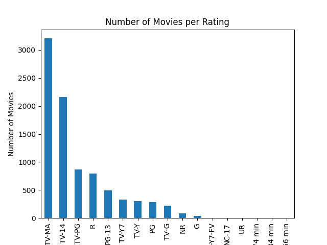

# Netflix Data Analysis using Python
This project analyzes Netflix dataset using Python, Pandas, and Matplotlib.

## Tools Used
- Python
- Pandas
- Matplotlib

## Analysis Performed
- Number of movies per year
- Genre distribution
- Rating distribution

## Visualizations
### Genre Bar Chart

### Rating Bar Chart

## Conclusion
- Identified most common genres on Netflix
- Analyzed rating trends
- Visualized data using graphs
